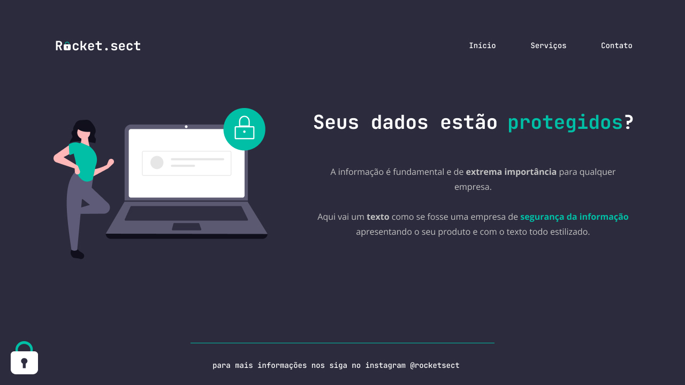

<h1 align="center"> Rocket.sect </h1>

Rocket.sect é um site desenvolvido como projeto para o ensino de tecnologias WEB da Rocketseat.  

  <a href="#-tecnologias">Tecnologias</a>&nbsp;&nbsp;&nbsp;|&nbsp;&nbsp;&nbsp;
  <a href="#-projeto">Projeto</a>&nbsp;&nbsp;&nbsp;|&nbsp;&nbsp;&nbsp;
  <a href="#-layout">Layout</a>&nbsp;&nbsp;&nbsp;|&nbsp;&nbsp;&nbsp;
  <a href="#memo-licença">Licença</a>f

  

 

  

## 🚀 Tecnologias

Esse projeto foi desenvolvido com as seguintes tecnologias:

- HTML e CSS
- Git e Github
- Figma

## 💻 Projeto

Este site foi criado utilizando os conceitos de html e css adquiridos no curso da rocketseat para desenvolvimento Web.
- [Visite o projeto online](https://alexsandro-oliveria.github.io/Rocket.sect)

## 🔖 Layout

Você pode visualizar o layout do projeto através [DESSE LINK](https://www.figma.com/file/52MPcqjT3GwmsORXSkPNMc/Explorer-(Copy)?node-id=16%3A106&t=U1aqMElzVhuPYIM5-1). É necessário ter conta no [Figma](https://figma.com) para acessá-lo.

## :memo: Licença

Esse projeto está sob a licença MIT.

---

By Alexsandro :wave: